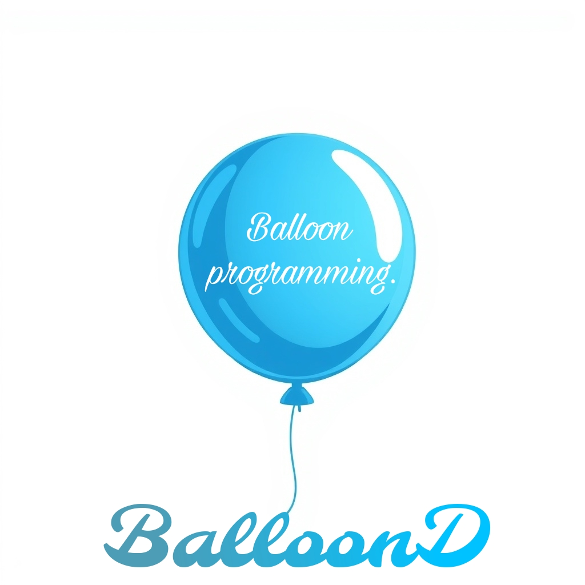

# DynamiScript

**DynamiScript** هي مكتبة برمجة متقدمة لإنشاء وتخصيص البالونات مع خيارات توصيل مرنة. تقدم المكتبة أدوات قوية لإنشاء واجهات تفاعلية بطرق مبتكرة وسهلة الاستخدام.

 <!-- يمكنك استبدال الرابط بصورة شعار المكتبة -->

## 🎨 الميزات

- **إنشاء بالونات تفاعلية**: تخصيص النصوص، الألوان، والخلفيات.
- **توصيل البالونات**: خطوط ملونة تربط بين البالونات لتوضيح العلاقات.
- **تخصيص الأيقونات**: خيارات متعددة للأيقونات لتناسب وظائف مختلفة.
- **تفاعل سهل**: دعم السحب والتحريك والتعديل التفاعلي.

## 📥 التثبيت

### عبر npm

```bash
npm install dynamiscript
